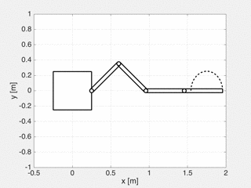
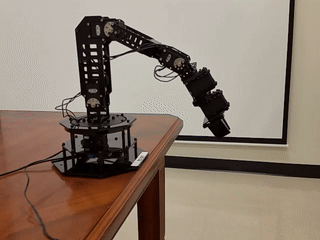

# SPART

SPART is an open-source modeling and control toolkit for mobile-base robotic multibody systems with kinematic tree topologies (*i.e.*, open-loop multi-branched systems).
SPART is MATLAB-based and ROS-compatible, allowing to prototype in simulation and deploy to hardware controllers for robotic systems.

Given a URDF description of a multibody system, SPART computes the system's:

* Kinematics -- pose of the links and joints (`i.e.`, rotation matrices and position vectors).
* Differential kinematics -- operational space velocities and accelerations, as well as the geometric Jacobians and their time derivatives.
* Dynamics -- generalized inertia and convective inertia matrices.
* Forward/Inverse dynamics -- solves both problems, including the floating-base case.

SPART supports symbolic computation and analytic expressions for all kinematic and dynamic quantities can be obtained.

## Installation

Just clone or download the toolkit and run the `SPART2path.m` script. This will add all the SPART MATLAB functions and the Simulink library to the path and save it. Then you can use it as any other MATLAB toolbox.

To run an example go to `Examples/URDF_Tutorial` and run:

	URDF_Tutorial

## Documentation

Up to date documentation and tutorials are available at [spart.readthedocs.org](http://spart.readthedocs.org).

## Examples

Here is an example of a planar Desired-Reaction-Maneuver, where the kinematic redundancy of a manipulator is exploited to make the floating base point towards the end-effector, while this one is moving along a prescribed path.

SPART can also be used to control real manipulators. Here is an example of resolved motion-rate control of the R5D3 manipulator (the tip of the end-effector is describing a triangle in space).

## License

This software is released under the LGPLv3 license.

