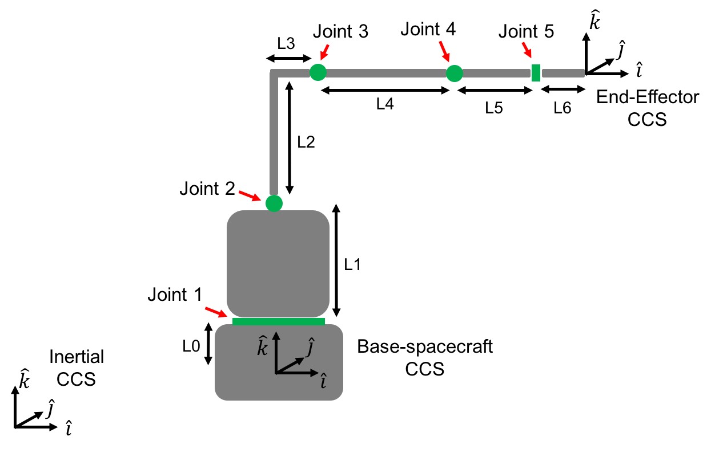
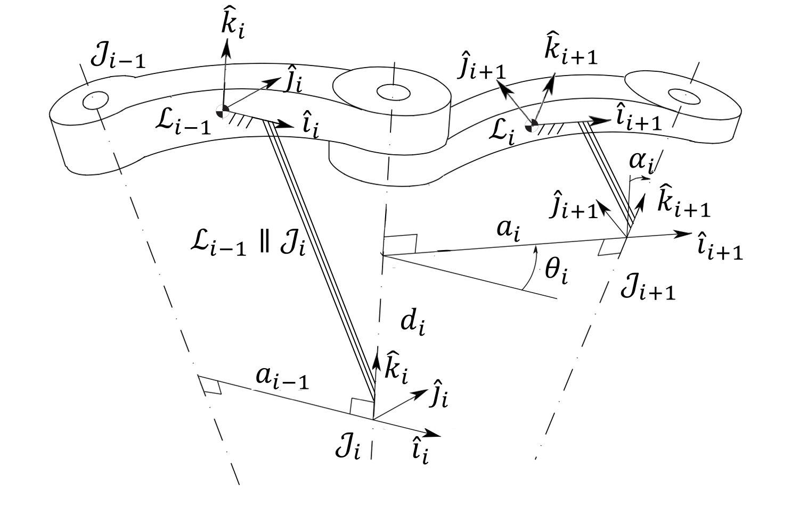
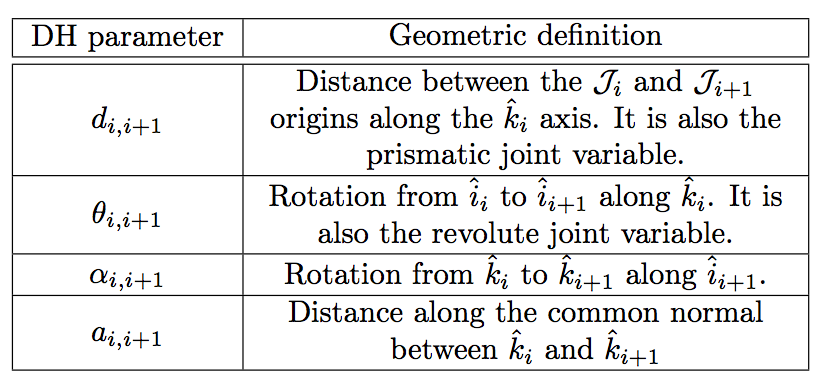
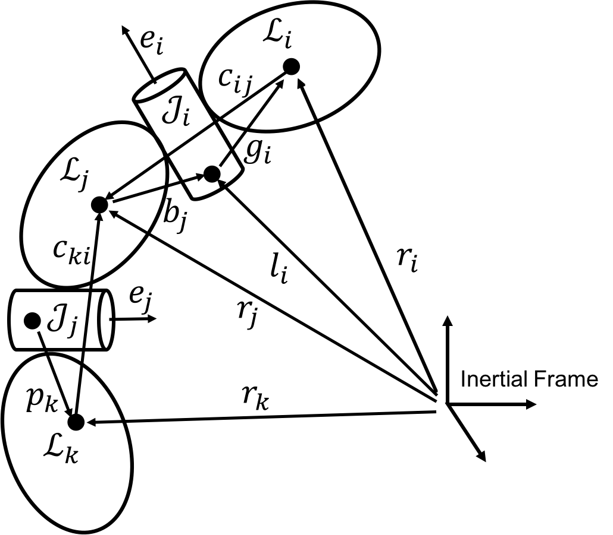
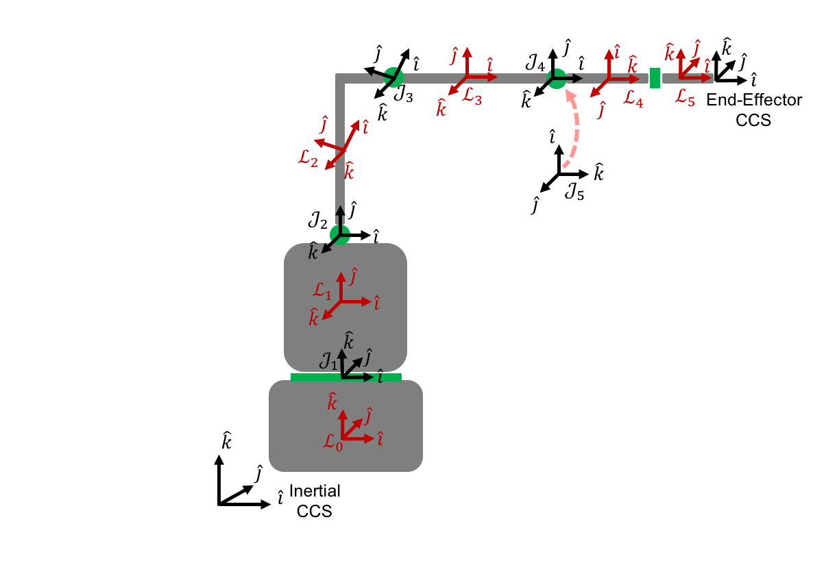

===================================================
Using the Denavit--Hartenberg convention with SPART
===================================================

The DEnavit--Hartenberg (DH) convention is a classical way to provide the kinematic description of a manipulator. To illustrate how to input DH description into SPART we will use the following spacecraft with a 5 degree-of-freedom manipulator example with the following dimensions: L0=50, L1=125, L2=144, L3=47, L4=142, L5=80, L6=70 mm.

   Spacecraft-manipulator system.

The code of this tutorial can be found in ``examples/Tutorial/Tutorial.m``.

Kinematics
==========

Before SPART can start computing any kinematic or dynamic magnitude it needs a representation of the geometry and dynamic properties of the spacecraft-manipulator system. These fixed parameters are introduced into a ``data`` structure.

The data structure has 3 fields:
	* data.n -- Number of links.
	* data.man(i) -- Describes the ith link/joint.
		* data.man(i).type -- Type of joint. 0 for fixed, 1 for a revolute joint, 2 for a prismatic joint.
		* data.man(i).DH -- Denavit--Hartenberg parameters. Definitions are included below.
		* data.man(i).b -- Vector from the Center-of-Mass of the link to the next joint in the local frame.
		* data.man(i).mass -- Mass of the link.
		* data.man(i).I -- Inertia matrix of the link.
	* data.base -- Describes the base--spacecraft.
		* data.base.T_L0_J1 -- Homogeneous transformation matrix from the base to the first joint.
		* data.base.mass -- Mass of the base--spacecraft.
		* data.base.I -- Inertia matrix of the base--spacecraft
	* data.EE -- Provides additional information about the end--effector
		* data.EE.theta -- Final rotation about the z axis. Last joint DH parameters are not enough to completely specify the orientation of the x and y end--effector axes.
		* data.EE.d -- Final translation about the z--axis. Last joint DH parameters are not enough to completely specify the location of the end-effector frame origin along the z--axis.

The kinematic relationship between a pair of connected joints is expressed by the Denavit--Hartenberg parameters.

   Denavit-Hartenberg parameters.

   Denavit-Hartenberg parameters and their geometric definition.

Additional geometric definitions are included in the following figure.

   Schematic disposition of links and joints.

The DH convention does not specify the orientation and origin of the first joint CCS (it's origin must lie within the rotation or sliding axis). We then have freedom to set these. The orientation and the origin of the first joint are specified through the homogeneous transformation matrix data.base.T_L0_J1. An homogeneous transformation matrix encapsulates the orientation and position for a CCS with respect to another one, and in this particular case it can be written as follows.

.. math::
	
	^{\mathcal{L}_{0}}T_{\mathcal{J}_{1}}=\left[\begin{array}{cc}
	^{\mathcal{L}_{0}}R_{\mathcal{J}_{1}} & ^{\mathcal{L}_{0}}s_{\mathcal{J}_{1}}\\
	0_{1,3} & 1
	\end{array}\right]

For this example we will assume that the base CCS and the first joint frame :math:`\mathcal{J}_{1}` share the same orientation :math:`^{\mathcal{L}_{0}}R_{\mathcal{J}_{1}}=I_{3\times 3}` and that :math:`\mathcal{J}_{1}` is only displaced L0 in the :math:`k` direction  :math:`^{\mathcal{L}_{0}}s_{\mathcal{J}_{1}}=\left[0,0,L_{0}\right]^{T}`.

.. code-block:: matlab

	%Firts joint location with respect to base
	data.base.T_L0_J1=[eye(3),[0;0;L0];zeros(1,3),1];

We will also assume that the links are homogeneous bodies and so their center-of-mass will be located at their geometric center, which allows to easily determine the data.man(i).b vector. The data.man(i).b vector goes from the center-of-mass of the ith link to the origin of the ith+1 joint in the local ith link reference frame.
Using the DH parameters and assuming homogeneous bodies the DH and b vector are given below.

===========  ======  ==========  ===================  ===============  =================
Joint/Link    DH.d    DH.alpha          DH.a             DH.theta              b
===========  ======  ==========  ===================  ===============  =================
 Joint 1       L1       pi/2             0                   0             [0;L1/2;0] 
 Joint 2       0         0         sqrt(L2^2+L3^2)      atan2(L2,L3)       \*see below
 Joint 3       0         0              L4             --atan2(L2,L3)       [L4/2;0;0] 
 Joint 4       0       	pi/2             0                  pi/2          [0;0;--L5/2] 
 Joint 5     L5+L6      --pi/2            0                 -pi/2           [L6/2;0;0] 
===========  ======  ==========  ===================  ===============  =================

data.man(2).b = [cos(-data.man(2).DH.theta),-sin(-data.man(2).DH.theta),0;sin(-data.man(2).DH.theta),cos(-data.man(2).DH.theta),0;0,0,1]*[L3^2/2;L2^2/2 + L3*L2;0]/(L2 + L3);

The resulting links and joints Cartesian Coordinate Systems are shown in the following image.

   CCS of the spacecraft-manipulator system.

Finally, the DH parameters do not allow to freely set the end-effector CCS. For that we need two additional :math:`d` and :math:`\theta` DH parameters, that are applied to the last transformation. In this case the required values are as follows.

.. code-block:: matlab
	
	%End-Effector
	data.EE.theta=-pi/2;
	data.EE.d=0;

We can then create our data structure:

.. code-block:: matlab
	
	%--- Manipulator Definition ----%
	%Number of joints/links
	data.n=5;

	%First joint
	data.man(1).type=1;
	data.man(1).DH.d = L1;
	data.man(1).DH.alpha = pi/2;
	data.man(1).DH.a = 0;
	data.man(1).DH.theta=0;
	data.man(1).b = [0;L1/2;0];

	%Second joint
	data.man(2).type=1;
	data.man(2).DH.d = 0;
	data.man(2).DH.alpha = 0;
	data.man(2).DH.a = sqrt(L2^2+L3^2);
	data.man(2).DH.theta=atan2(L2,L3);
	data.man(2).b = [cos(-data.man(2).DH.theta),-sin(-data.man(2).DH.theta),0;sin(-data.man(2).DH.theta),cos(-data.man(2).DH.theta),0;0,0,1]*[L3^2/2;L2^2/2 + L3*L2;0]/(L2 + L3);

	%Third joint
	data.man(3).type=1;
	data.man(3).DH.d = 0;
	data.man(3).DH.alpha = 0;
	data.man(3).DH.a =L4;
	data.man(3).DH.theta=-atan2(L2,L3);
	data.man(3).b = [L4/2;0;0];

	%Fourth joint
	data.man(4).type=1;
	data.man(4).DH.d = 0;
	data.man(4).DH.alpha = pi/2;
	data.man(4).DH.a = 0;
	data.man(4).DH.theta=pi/2;
	data.man(4).b = [0;0;-L5/2];

	%Fifth joint
	data.man(5).type=1;
	data.man(5).DH.d = L5+L6;
	data.man(5).DH.alpha =-pi/2;
	data.man(5).DH.a = 0;
	data.man(5).DH.theta=-pi/2;
	data.man(5).b = [L6/2;0;0];

	%Firts joint location with respect to base
	data.base.T_L0_J1=[eye(3),[0;0;L0];zeros(1,3),1];

	%End-Effector
	data.EE.theta=-pi/2;
	data.EE.d=0;

Dynamic parameters
==================

Let's assume, for the sake of simplicity, that all the links masses are 2 kg and have diagonal inertia matrices with :math:`I_{xx}=2/10`, :math:`I_{yy}=1/10`, and :math:`I_{zz}=3/10\, \mathrm{kg\,m}^2`. And the base-spacecraft has a mass of 20 kg and inertia of :math:`I_{xx}=2`, kg/m2 :math:`I_{yy}=1`, and :math:`I_{zz}=3 \, \mathrm{kg\,m}^2`.

These variables can be added to the data structure as follows.

.. code-block:: matlab

	%First joint
	data.man(1).mass=2;
	data.man(1).I=diag([2,1,3])/10;

	%Second joint
	data.man(2).mass=2;
	data.man(2).I=diag([2,1,3])/10;

	%Third joint
	data.man(3).mass=2;
	data.man(3).I=diag([2,1,3])/10;

	%Fourth joint
	data.man(4).mass=2;
	data.man(4).I=diag([2,1,3])/10;

	%Fifth joint
	data.man(5).mass=2;
	data.man(5).I=diag([2,1,3])/10;

	%Base-spacecraft mass and inertia
	data.base.mass=20;
	data.base.I=diag([2,1,3]);

Creating the robot model
========================

Now that we have a complete description of the manipulator we can convert it into a robot model.

.. code-block:: matlab
	
	%Create robot structure
	[robot,T_Ln_EE] = DH_Serial2robot(data);

