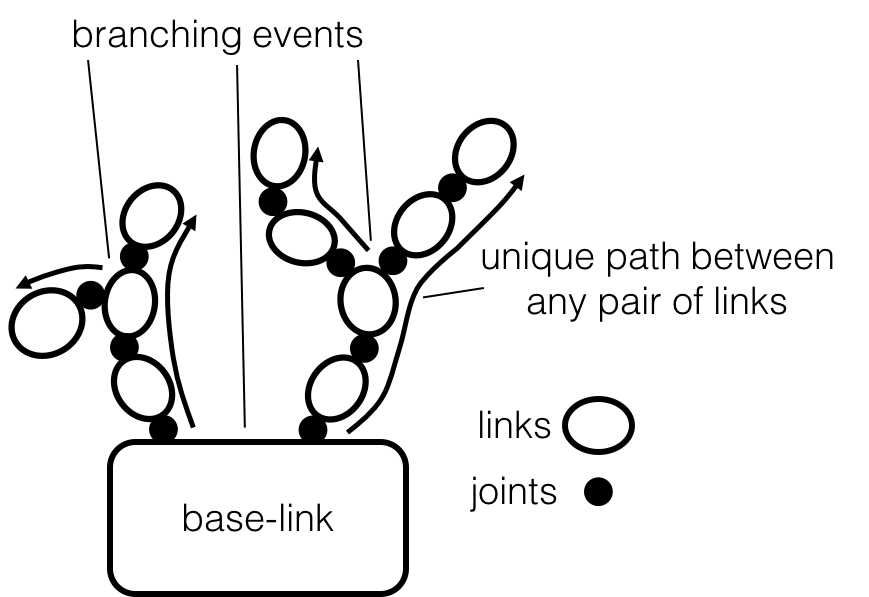
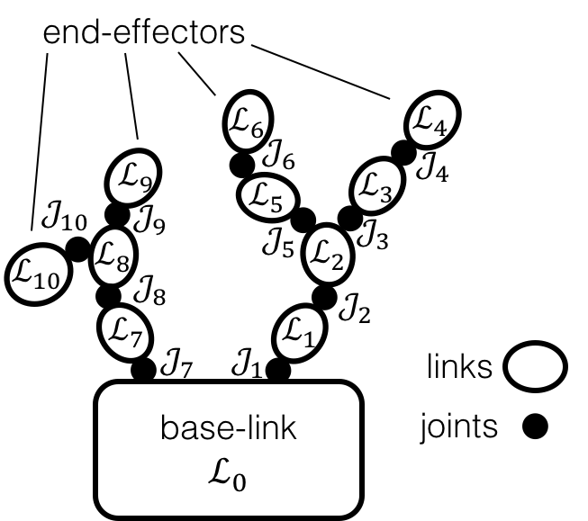
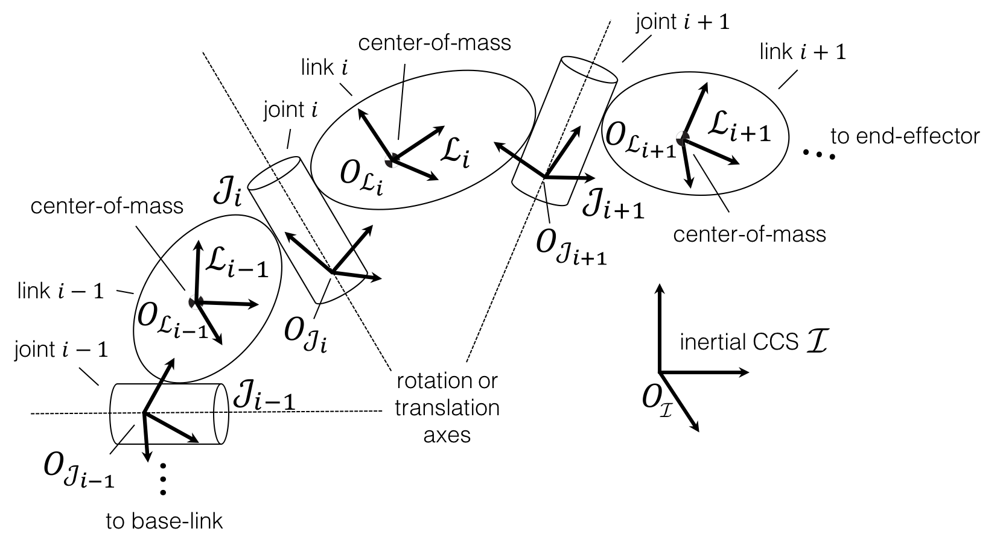
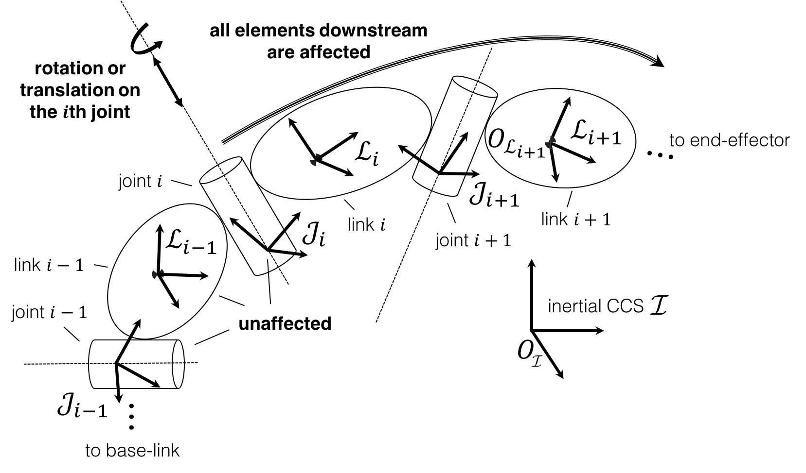

==============================
SPART Tutorial -- Introduction
==============================

This tutorial covers the basic functionality of SPART and introduces some concepts of multibody systems. The tutorial is structured in three sections:

* Introduction -- Covers the nomenclature and conventions used by SPART.
* :doc:`/Tutorial_Robot` -- Covers the URDF description of a multibody system and the SPART ``robot`` structure.
* :doc:`/Tutorial_Kinematics` -- Covers the kinematics -- positions, orientations, velocities, and accelerations -- of the system.
* :doc:`/Tutorial_Dynamics` -- Covers how to obtain the inertia matrices, equations of motion, and solve the forward/inverse dynamic problem.

The code in this tutorial can be found in ``examples/URDF_Tutorial/URDF_Tutorial.m``.

.. note::

	Before starting this tutorial make sure you have correctly installed and configured SPART. See :doc:`/Installation` for instructions.

Kinematic tree topology
=======================

A multibody system is defined as a collection of bodies coupled by massless **joints**. The bodies of the system -- also known as **links** -- are arranged in one of two basic types of kinematic chains:

* Kinematic trees, when the path between any pair of links is unique. This  are also known as open-loop kinematic chains.
* Closed-loop kinematic chains, when the path between any pair of links is not unique.

SPART is only able to handle multibody systems composed of **rigid bodies** arranged in **kinematic trees**.

   Kinematic tree.

Joint/Link nomenclature and numbering scheme
============================================

A link is denoted by :math:`\mathcal{L}_{i}` and a joint by :math:`\mathcal{J}_{i}`, with the number :math:`i` used as a unique identifier of each link or joint. In SPART, the number :math:`i` is used to access the results associated with a specific link or joint. 

In a kinematic tree, one of the links is designated as the **base-link**, with :math:`i=0` and :math:`\mathcal{L}_{0}`. The base-link can be selected arbitrarily among all the links, yet an obvious choice usually exists.

A link :math:`\mathcal{L}_{i}` can be connected with an arbitrary number of other links via an equal number of joints. Only one of these other links lies within the path connecting :math:`\mathcal{L}_{i}` and the base-link :math:`\mathcal{L}_{0}`. This *previous/upstream* link :math:`\mathcal{L}_{i-1}` is known as the *parent link* of :math:`\mathcal{L}_{i}` and the joint connecting these two links is :math:`\mathcal{J}_{i}`. The rest of links directly connected to link :math:`\mathcal{L}_{i}` are *child links* :math:`\mathcal{L}_{i+1}`. A *branching event* occurs when a link has multiple children.

In the regular number scheme used by SPART, each children link is given a higher number :math:`i` than its parent, with the base link given the number :math:`i=0`. In a branching event multiple numbering options exist and they can be chosen arbitrarily among them. The notation :math:`i+1` and :math:`i-1` is here abused to denote the child and parent link or joint, even when they are not sequentially numbered. Additionally, the total number of joints :math:`n` is also used to refer to the last joint and link of a branch. The last link of a branch is also commonly referred to as an **end-effector**.

   Regular numbering scheme.

Joints types
============

Three type of joints primitives can be modeled with SPART:

* Fixed -- a joint rigidly connecting the pair of links (zero degrees-of-freedom).
* Revolute -- a joint that allows a rotation around a common rotation axis :math:`\hat{e}_{i}` (one degree-of-freedom).
* Prismatic -- a joint that allows a translation along a common sliding axis :math:`\hat{e}_{i}` (one degree-of-freedom).

More complex joints (*e.g.*, planar, spherical, helical, ...) can be constructed as a combination of these primitive joints connected by massless and dimensionless links.

Only revolute and prismatic joints are active joints, with the rotation or translation **displacement** denoted by :math:`q_{i}`.

Cartesian Coordinate Systems (CCS)
==================================

Each link and joint has an associated Cartesian Coordinate System (CCS).  The origin of the link CCS is located at the link's center-of-mass, and the origin of the joint CSS is located on the rotation/sliding axis. The orientations of the CCS are arbitrary.

   Cartesian Coordinate Systems.

Joint displacements
===================

Another convention in SPART is that a displacement on a joint affects all the elements downstream, but it doesn't affect the orientation or position of that joint CCS.

   Effects of a joint displacement.
