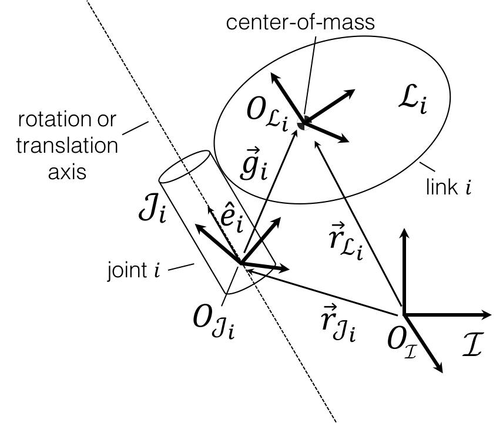

============================
SPART Tutorial -- Kinematics
============================

Direct Kinematics
=================

SPART can compute the position and orientation of all the links and joints. The definitions of the kinematic quantities of a generic link and joint are notionally shown in the following figure.

   Schematic disposition of a generic link and its associated joint.

To obtain the kinematics of the system, the base-link position :math:`\mathrm{r}_{0}\in\mathbb{R}^{3}` and orientation, as a rotation matrix :math:`\mathrm{R}_{0}\in\mathrm{SO}\left(3\right)`, with respect to the inertial CCS are first specified.

.. code-block:: matlab

	%Base-link position and orientation
	R0=eye(3);  %Rotation from base-link with respect to the inertial CCS.
	r0=[0;0;0]; %Position of the base-link with respect to the origin of the inertial frame, projected in the inertial CCS.

In SPART, the vectors are represented by a 3-by-1 column matrix containing the components of the vector projection to the inertial CCS. Projections to other CCS are explicitly marked.

.. note::

	The position of the base-link ``r0`` refers to the base-link center-of-mass, corresponding with the origin of the URDF ``inertial`` tag. The base-link orientation ``R0`` also corresponds with the orientation of the CCS specified in the URDF ``inertial`` tag.

The joint displacements, :math:`\mathbf{q}_{m}\in\mathbb{R}^{n}`, also also defined as a :math:`n`-by-1 column matrix.

.. math::

	\mathbf{q}_{m}=\begin{bmatrix}q_{1} \\ q_{2} \\ \vdots \\ q_{n} \end{bmatrix}

.. code-block:: matlab

	%Joint displacements
	qm=[0;0;0];

If the :math:`i`\th joint is revolute, :math:`q_{i}` denotes an angular displacement around the rotation axis :math:`\hat{e}_{i}`, whether if the :math:`i`\th joint is prismatic, :math:`q_{i}` denotes a translational displacement along the sliding axis :math:`\hat{e}_{i}`.

The set of :math:`\mathbf{R}_{0},\mathbf{r}_{0},\mathbf{q}_{m}` constitute a set of variables :math:`\mathcal{Q}`, known as *generalized variables*, which full define the state of the multibody system,

.. math::

	\mathcal{Q}=\left\lbrace\mathbf{R}_{0},\mathbf{r}_{0},\mathbf{q}_{m}\right\rbrace

With the generalized variables specified, SPART is ready to compute the kinematics of the system.

.. code-block:: matlab

	%Kinematics
	[RJ,RL,rJ,rL,e,g]=Kinematics(R0,r0,qm,robot);

The output of the ``Kinematics`` function is as follows:

* RJ -- Joint 3x3 rotation matrices -- as a [3x3xn] matrix.
* RL -- Links 3x3 rotation matrices -- as a [3x3xn] matrix.
* rJ -- Positions of the joints projected in the inertial CCS -- as a [3xn] matrix.
* rL -- Positions of the links projected in the inertial CCS -- as a [3xn] matrix.
* e -- Joint rotation/sliding axis projected in the inertial CCS -- as a [3xn] matrix.
* g -- Vector from the origin of the ith joint CCS to the origin of the ith link CCS, projected in the inertial CCS -- as a [3xn] matrix.

The results for each link/joint are stacked into a single variable. For example, to get the position of the second link center-of-mass:

.. code-block:: matlab

	%Position of the center-of-mass of a link
	i=2;
	rL(1:3,i)

and the rotation matrix corresponding to the second link CCS:

.. code-block:: matlab

	%Position of the center-of-mass of a link
	i=2;
	RL(1:3,1:3,i)

If your Matlab installation includes the `Symbolic Math Toolbox <https://www.mathworks.com/products/symbolic.html>`_ SPART is able to obtain the analytic expressions of these kinematic quantities. To do so, just define the generalized variables as *symbolic expressions*.

.. code-block:: matlab

	%Base-link position
	r0=sym('r0',[3,1],'real');

	%Base-link orientation
	Euler_Ang=sym('Euler_Ang',[3,1],'real');
	R0 = Angles321_DCM(Euler_Ang)';

	%Joint displacements
	qm=sym('qm',[robot.n_q,1],'real');

	%Kinematics
	[RJ,RL,rJ,rL,e,g]=Kinematics(R0,r0,qm,robot);

.. warning::
   To obtain analytic expressions, all inputs must be symbolic. Otherwise, errors may occur.

Differential kinematics
=======================

The angular and linear velocities of the :math:`i`\th link with respect to the inertial frame, projected in the inertial CCS, are encapsulated into the **twist** variable :math:`\mathbf{t}_{i}\in\mathbb{R}^{6}`.

.. math::

	\mathbf{t}_{i}=\begin{bmatrix}\mathbf{\omega}_{i}\\ \dot{\mathbf{r}}_{i}\end{bmatrix}

The twist can be recursively propagated outward from one link to the next using the 6-by-6 :math:`\mathbf{B}_{ij}` twist--propagation matrix and the 6-by-1 :math:`\mathbf{p}_{i}` twist--propagation "vector":

.. math::
	
	\mathbf{t}_{i}=\mathbf{B}_{ij}\mathbf{t}_{j}+\mathbf{p}_{i}\dot{q}_{i}\quad\text{for}\quad j=i-1

The twist--propagation matrices and "vectors", which form the basis of the differential kinematics, can be computed with the ``DiffKinematics`` function.

.. code-block:: matlab

	%Differential kinematics
	[Bij,Bi0,P0,pm]=DiffKinematics(R0,r0,rL,e,g,robot);

The output of the differential kinematics is as follows:

* Bij -- Twist--propagation [6x6xn] matrix (for manipulator i>0 and j>0).
* Bi0 -- Twist--propagation [6x6xn] matrix (for i>0 and j=0).
* P0 -- Base--link twist--propagation [6x6] matrix.
* pm -- Manipulator twist--propagation [6xn] vector.

The set of generalized velocities :math:`\mathbf{u}\in\mathbb{R}^{6+n}` (joint-space velocities) contains the base-link velocities :math:`\mathbf{u}_{0}\in\mathbb{R}^{6}` and the joint velocities :math:`\mathbf{u}_{m}\in\mathbb{R}^{n}`. 

.. math::

	\mathbf{u} = \begin{bmatrix}\mathbf{u}_{0} \\ \mathbf{u}_{m} \end{bmatrix}

With the base-link and joint velocities defined as:

.. math::

	\mathbf{u}_{0} = \begin{bmatrix}\mathbf{\omega}^{\left\{\mathcal{L}_{0}\right\}}_{0} \\ \dot{\mathbf{r}}_{0} \end{bmatrix}

	\mathbf{u}_{m} = \begin{bmatrix}\dot{q}_{1} \\ \vdots \\ \dot{q}_{n} \end{bmatrix}

Note that :math:`\mathbf{\omega}^{\left\{\mathcal{L}_{0}\right\}}_{0}` denotes the angular velocity of the base-link, with respect to the inertial frame, projected in the base-link body-fixed CCS (this is the angular velocity that is obtained when using an onboard rate-gyro).

For the base-link, the twist is computed only using a modified 6-by-6 :math:`\mathbf{P}_{0}` twist-propagation matrix.

.. math::
	
	\mathbf{t}_{0}=\mathbf{P}_{0}u_{0}

With the twist-propagation quantities and the generalized velocities, the twists of all the links (operational-space velocities) can be determined.
	
.. code-block:: matlab

	%Generalized velocities (joint-space velocities)
	u0=zeros(6,1); %Base-link angular (projected in the base-link body-fixed CCS) and linear velocities.
	um=[4;-1;5]*pi/180; %Joint velocities

	%Twist (operational-space velocities)
	[t0,tL]=Velocities(Bij,Bi0,P0,pm,u0,um,robot);

The output of the operational space velocities are as follows:

* t0 -- Base--link twist projected in the inertial CCS -- as a [6x1] matrix.
* tL -- Manipulator links twist projected in the inertial CCS -- as a [6xn] matrix.

Jacobians
=========

The geometric Jacobian of a point :math:`p` maps the joint-space velocities :math:`\mathbf{u}` into operational-space velocities of that point :math:`\mathbf{t}_{p}`.

.. math::
	
	\mathbf{t}_{p}=\mathbf{J}_{p}\mathbf{u}

The contribution from the base-link and from the joints can be written more explicitly as: 

.. math::
	\mathbf{J}_{p} = \begin{bmatrix}\mathbf{J}_{0p} &  \mathbf{J}_{mp}\end{bmatrix}

	\mathbf{t}_{p}=\mathbf{J}_{0p}\mathbf{u}_{0}+\mathbf{J}_{mp}\mathbf{u}_{m}

The Jacobian of a point :math:`p`, fixed to the :math:`i`\th link, can be obtained as follows:

.. code-block:: matlab

	%Jacobian of a point p in the ith link
	%rp is the position of the point p, projected in the inertial CCS -- as a [3x1] matrix.
	[J0p, Jmp]=Jacob(rp,r0,rL,P0,pm,i,robot);

The Jacobians corresponding to the center-of-mass of the the :math:`i`\th link of the multibody system are then computed as follows:

.. code-block:: matlab

	%Jacobian of the ith Link
	[J0i, Jmi]=Jacob(rL(1:3,i),r0,rL,P0,pm,i,robot);

Accelerations
=============

The accelerations of a link can be encapsulated in a twist-rate :math:`\dot{\mathbf{t}}_{i}\in\mathbb{R}^{6}`:

.. math::

	\dot{\mathbf{t}}_{i}=\begin{bmatrix}\dot{\mathbf{\omega}}_{i}\\ \ddot{\mathbf{r}}_{i}\end{bmatrix}

The generalized accelerations :math:`\dot{\mathbf{u}}\in\mathbb{R}^{6+n}` of the system are defined as:

.. math::

	\dot{\mathbf{u}} = \begin{bmatrix}\dot{\mathbf{u}}_{0} \\ \dot{\mathbf{u}}_{m} \end{bmatrix}

The twist-rate can then be computed as follows:

.. code-block:: matlab

	%Define generalized accelerations
	u0=zeros(6,1); %Base-link angular (projected in the base-link body-fixed CCS) and linear accelerations
	um=[-0.1;0.2;0.1]*pi/180; %Joint accelerations

	%Accelerations, twist-rate
	[t0dot,tLdot]=Accelerations(t0,tL,P0,pm,Bi0,Bij,u0,um,u0dot,umdot,robot)

Jacobian time derivative
========================

The time derivatives of the Jacobians can also be obtained:

.. code-block:: matlab

	%Jacobain time derivative
	%rp is the position of the point p, projected in the inertial CCS -- as a [3x1] matrix.
	%tp is the twist of the point p -- as a [6x1] matrix.
	[J0pdot, Jmpdot]=Jacobdot(rp,tp,r0,t0,rL,tL,P0,pm,i,robot)

The Jacobian time derivative can be used to obtain the twist-rate of a point on the multibody system.

.. math::
	
	\dot{\mathbf{t}}_{p}=\mathbf{J}_{p}\dot{\mathbf{u}}+\dot{\mathbf{J}}_{p}\mathbf{u}

