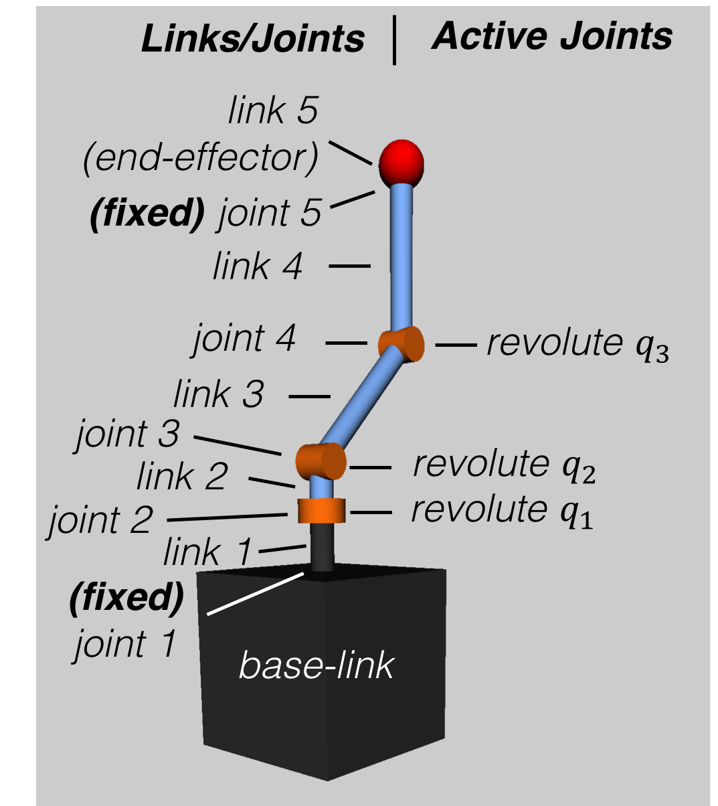

=============================
SPART Tutorial -- Robot Model
=============================

Example of a multibody system
=============================

This tutorial uses the following spacecraft equipped with a 3 degree-of-freedom manipulator as example.

   Example of a multibody system -- spacecraft with a 3 degree-of-freedom manipulator.

Using a URDF to describe a multibody system
===========================================

In SPART, the preferred method to describe a multibody system is via a URDF file. URDF files are also the descriptor files used in ROS. To learn how to write URDF files, refer to the `URDF documentation <http://wiki.ros.org/urdf>`_  on the ROS wiki.

It is important to note that in SPART:

* Only fixed, revolute, continuous, and prismatic joints are accepted.
* Continuous and revolute joints are treated equally. Joint displacement, velocity, and effort limits are not taken into consideration.
* Joint dynamics (*e.g.*, damping) are not modeled. 

The URDF of the spacecraft with the manipulator can be found in ``URDF_models\SC_3DoF.urdf``. Other examples are included in the `URDF_models`` folder, and a list of these models can be found in :doc:`/URDF_Models`.

.. note::
   
   xacro files can be converted to a *pure* URDF file by running the following command

   .. code:: sh

      rosrun xacro xacro --inorder -o robot.urdf robot.urdf.xacro

Reading a URDF file
===================

SPART takes a URDF file and converts it to the SPART ``robot`` structure.

.. code-block:: matlab

   %URDF filename
   filename='SC_3DoF.urdf';

   %Create robot model
   [robot,robot_keys] = urdf2robot(filename);

The ``robot`` structure
=======================

The ``robot`` structure contains all the required kinematic and dynamic information of the multibody system. Build as a MATLAB structure it contains the following fields:

   * robot.name -- Name of the robot.
   * robot.n_q -- Number of active joints.
   * robot.n_links_joints -- Number of manipulator links and joints (includes fixed joints, and excludes the base-link).
   * robot.links -- Structure with the data of the links.

      * robot.links(i).id -- Link id.
      * robot.links(i).parent_joint -- Parent joint id.
      * robot.links(i).T -- Homogeneous transformation matrix from parent joint [4x4].
      * robot.links(i).mass -- Link's mass.
      * robot.links(i).inertia -- Link's inertia matrix [3x3], projected in the body-fixed link's CCS.

   * robot.joints -- Structure with the data of the joints.

      * robot.joints(i).id -- Joint id.
      * robot.joints(i).type -- Joint type (0 -- fixed, 1 -- revolute, 2 -- prismatic)
      * robot.joints(i).q_id -- Active joint id (if q_id=-1 indicates a fixed joint).
      * robot.joints(i).parent_link -- Parent link id.
      * robot.joints(i).child_link -- Child link id.
      * robot.joints(i).axis -- Joint rotation or sliding axis [3x1].
      * robot.joints(i).T -- Homogeneous transformation matrix from parent link [4x4].

   * robot.base_link -- Structure with the data of the base-link.

      * robot.base_link.mass -- Base-link's mass.
      * robot.base_link.inertia -- Base-link's inertia matrix [3x3], projected in the body-fixed base-link's CCS.

   * robot.con -- Structure with additional connectivity information.
   
      * robot.con.branch -- Branch connectivity map. This is a [nxn] lower triangular matrix. If the i,j element is 1 it means that the ith and jth link are on the same branch. 
      * robot.con.child -- A [nxn] matrix. If the i,j element is 1, then the ith link is a child of the jth link.
      * robot.con.child_base -- A [nx1] matrix. If the ith element is 1, the ith link is connected to the base-link.

Understanding the ``robot`` structure and the ``robot_keys`` map
================================================================

After reading the URDF of the spacecraft with the robotic manipulator, we obtain the ``robot`` structure and we can start querying it.

For example let's check how many acting joints there are:

.. code-block:: matlab

   >> robot.n_q

   ans =

     3

As the manipulator has only 3 revolute joints, this results is correct. Now let's check how many joints and links there are in the system:

.. code-block:: matlab

   >> robot.n_joints_links

   ans =

     5

which coincides with the number of revolute and fixed joints added together.

The ``robot_keys`` map can be used to map the names used in the URDF to the numbers used in SPART to uniquely identify the joints and links.

To know the URDF names of all links, joints, and active joints:

.. code-block:: matlab

   link_names=keys(robot_keys.link_id);
   joint_names=keys(robot_keys.joint_id);
   qm_names=keys(robot_keys.q_id);

To get the corresponding id of a URDF joint/link name use:

.. code-block:: matlab

   robot_keys.link_id('Link_name')
   robot_keys.joint_id('Joint_name')
   robot_keys.q_id('Joint_name')

The properties of the :math:`i`\th link (*e.g.*, :math:`i=2`) can be inspected as follows:

.. code-block:: matlab

   i=2;
   robot.links(i)

The properties of the joints can be inspected in an equivalent manner:

.. code-block:: matlab

   i=2;
   robot.joints(i)

Alternative methods to create the ``robot`` structure
=====================================================

SPART also allows to create this ``robot`` structure using two other input methods:

* With the Denavit-Hartenberg (DH) parameters. Refer to the :doc:`/DH` page for the procedure to create a SPART ``robot`` structure using DH parameters.
* Manually populate the ``robot`` structure.
